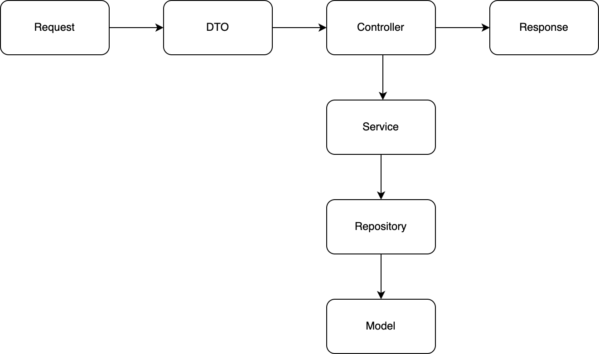

# Dependencies

- GIN
- GORM
- VIPER

# 폴더구조

- docs : swagger
- internal : 소스코드
- tools : 공통적으로 사용되는 함수
- scripts : 빌드, 테스트 등 을 위한 스크립트
- test : API를 호출하여 테스트

# API 구조도



# Rule

1. interface 사용하지 않음
1. 코멘트 허용
1. import 가능 규칙
   - Controller: Service, DTO, Model
   - Service: Repository, DTO, Model
   - Repository: Model
   - Model: Model (단, Cycling이 되지 않아야한다.)
   - DTO : DTO
1. Controller
   - request 수신 및 response 반환
   - Service를 호출하여 로직 실행
   - 에러 로그는 여기서
1. Service
   - Repository를 호출하여 DB조회
   - Model의 비지니스 로직 실행
   - 트랜잭션 제어
1. Repository
   - GORM으로 DB데이터를 Model에 바인딩
1. Model
   - GORM 태그 설정
   - 비지니스 로직 구현

# test

```bash
docker compose up -d
go test ./test -coverpkg=./internal/... -coverprofile=./tmp/coverage.out
go tool cover -html=./tmp/coverage.out
```

# swagger 생성

```bash
swag init -g main.go
```

# TODO

~~1. 전체구조 구성~~

~~1. gin~~

~~1. docker compose~~

~~1. debug~~

~~1. gorm~~

~~1. test: test용 db~~

1. swagger: 구성하는 방법
1. md 정리
1. db 로그 모드 환경설정으로 컨트롤
1. response함수 리펙토링
